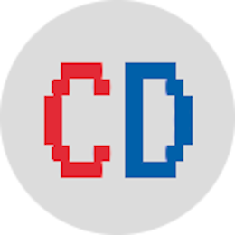

<!-- Improved compatibility of back to top link: See: https://github.com/othneildrew/Best-README-Template/pull/73 -->

<!-- PROJECT SHIELDS -->
<!--
*** I'm using markdown "reference style" links for readability.
*** Reference links are enclosed in brackets [ ] instead of parentheses ( ).
*** See the bottom of this document for the declaration of the reference variables
*** for contributors-url, forks-url, etc. This is an optional, concise syntax you may use.
*** https://www.markdownguide.org/basic-syntax/#reference-style-links
-->
[![MIT License][license-shield]][license-url]
[![LinkedIn][linkedin-shield]][linkedin-url]

<!-- PROJECT LOGO -->
 

  

<h3 align="center">COSTCODLE</h3>

  

    A Wordle-esque daily guessing game for Costco food products!
     
    <a href="https://github.com/KermWasTaken/costcodle"><strong>Explore the docs »</strong></a>
     
     
    <a href="https://costcodle.com">View Demo</a>
    ·
    <a href="https://github.com/KermWasTaken/costcodle/issues">Report Bug</a>
    ·
    <a href="https://github.com/KermWasTaken/costcodle/issues">Request Feature</a>
  

<!-- TABLE OF CONTENTS -->

  
Table of Contents

  <ol>
    <li>
      <a href="#about-the-project">About The Project</a>
      <ul>
        <li><a href="#built-with">Built With</a></li>
      </ul>
    </li>
    <li><a href="#license">License</a></li>
    <li><a href="#contact">Contact</a></li>
    <li><a href="#acknowledgments">Acknowledgments</a></li>
  </ol>

<!-- ABOUT THE PROJECT -->
## About The Project

[![Product Name Screen Shot][product-screenshot]](https://costcodle.com)

Guess the COSTCODLE in 6 tries.

* Each guess must be a valid price.
* Incorrect guesses will help guide you to the target price.

If you guess within 5% of the target price, you win!

A new COSTCODLE is available every day!

(<a href="#readme-top">back to top</a>)

### Built With

* [[HTML][HTML5]]]
* [[CSS][CSS3]]]
* [[JS][JavaScript]]

(<a href="#readme-top">back to top</a>)

<!-- LICENSE -->
## License

Distributed under the MIT License. See `LICENSE.txt` for more information.

(<a href="#readme-top">back to top</a>)

<!-- CONTACT -->
## Contact

Zachary Kermitz  - zakkermitz@gmail.com

Project Link: [https://github.com/KermWasTaken/costcodle](https://github.com/KermWasTaken/costcodle)

(<a href="#readme-top">back to top</a>)

<!-- ACKNOWLEDGMENTS -->
## Acknowledgments

This project would not have been possible without the following resources:

* [Wordle](https://www.nytimes.com/games/wordle/index.html)
* [Tradle](https://oec.world/en/tradle/)
* [Currency Format Input Field by Wade Williams](https://codepen.io/559wade/pen/LRzEjj)

(<a href="#readme-top">back to top</a>)

<!-- MARKDOWN LINKS & IMAGES -->
<!-- https://www.markdownguide.org/basic-syntax/#reference-style-links -->
[license-shield]: https://img.shields.io/github/license/KermWasTaken/costcodle.svg?style=for-the-badge
[license-url]: https://github.com/KermWasTaken/costcodle/blob/master/LICENSE.txt
[linkedin-shield]: https://img.shields.io/badge/-LinkedIn-black.svg?style=for-the-badge&logo=linkedin&colorB=555
[linkedin-url]: https://linkedin.com/in/zacharykermitz
[product-screenshot]: assets/costcodle.png
[HTML5]: https://img.shields.io/badge/html5-%23E34F26.svg?style=for-the-badge&logo=html5&logoColor=white
[CSS3]: https://img.shields.io/badge/css3-%231572B6.svg?style=for-the-badge&logo=css3&logoColor=white
[JavaScript]: https://img.shields.io/badge/javascript-%23323330.svg?style=for-the-badge&logo=javascript&logoColor=%23F7DF1E
